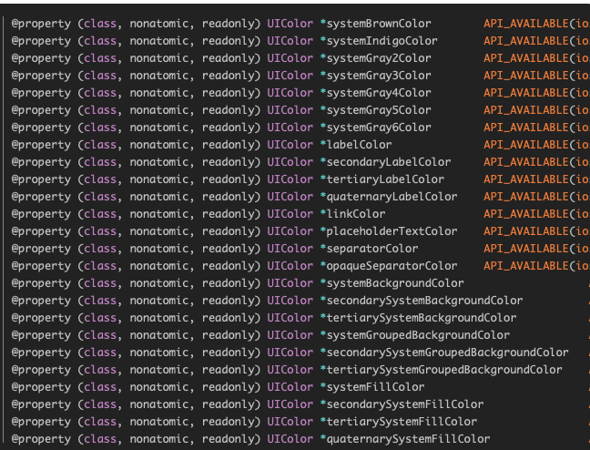

【手Q】iOS13适配绿皮书

| 导语 WWDC19: Write Code, Blow Mind. （编写代码，放飞梦想。）
目录
-- 前言
-- 编译篇
-- UIKit篇
-- PhotoKit篇
-- Privacy篇
-- Crash篇

前言 
      又是一年朝圣时，苹果公司自今年6月份推出iOS13系统以来，前后共更新了10个beta版本，并于9月11日正式发布了GM版。

      过去三个月中，手机QQ作为国内最大的社交APP之一，积极适配了iOS13系统下的各项新特性，以保证在新系统下用户的体验。最新的815版本，更是率先采用了Xcode 11进行打包集成。

      坊间皆知，使用Xcode 10编译的APP在iOS13系统下使用，几乎没有任何适应性问题；但Xcode 11编译的APP再在iOS13系统下运行，就存在着诸多的适配问题。在此，辛路历程，拟文涵盖。

一、编译篇
       为了解决Photos系统库头文件中使用了C++ 11 Forward declaration of enumerations特性引发的编译问题，把手Q所有参与编译的源码和静态库的C++标准都升级到了GNU++14标准，同时解决了标准升级后的编译问题如下：

对于给枚举类型变量赋整型值的错误，增加强制转换。

nil赋值给整型变量的情况统一把nil改为0。

typeof统一替换为__typeof。

其他由于类型不匹配导致的错误都统一使用强制转换处理。

二、UIKit篇
2.1 Dark-Mode模式的影响
1、背景

        iOS13苹果开启暗黑之旅，毫无疑问，Dark-Mode是苹果在iOS13上对于视觉感官的一次UI革新。

新增了动态颜色概念，定义了一批DynamicColor（如下截图所示）可以直接使用，来完成Light和Dark模式下的色值切换。

新增了获取当前模式的接口和监听通知，让用户更自由的去适配暗黑模式的切换。

2、系统行为

        如下截图，来看看Dark-Mode下的视图层级，对于“没有设置BackgroundColor的UI控件”，在暗黑模式下系统会自动的填充为UIDynamicSystemColor的动态色值，即会被设置成黑夜颜色。

3、对手Q的影响

       手Q适配iOS13暗黑特性的方案（开关入口如下图所示），是结合了自身的“夜间主题”效果，使其和系统的暗黑模式形成了联动，从而让APP进入黑夜模式。这里“联动”的关键技术点就是“准确获取系统模式的状态信息”。

       那么问题来了，当用户选择了不联动时，系统进入暗黑模式，手Q会仍然维持默认主题，基于上述验证的系统行为，就会导致手Q在Dark-Mode下，有的页面是黑色，有的页面是浅色的展示问题。

4、适配技术方案

（1）整体思路：

        利用苹果提供的两个属性（overrideUserInterfaceStyle属性和UIUserInterfaceStyle属性），来达到既不影响UI展示，也能准确获取系统模式。

（2）实施方案：

全局性配置，在工程的Info.plist的中，将UIUserInterfaceStyle设置为Automatic；此处保证了iOS13下系统接口的返回值，都是随系统模式的变化而进行的赋值，即可以准确获取到当前模式的状态信息。

单页性配置，hook住系统UIView的初始化接口，在hook的实现中将overrideUser-InterfaceStyle设置为UIUserInterfaceStyleLight，以强制手Q所有页面显示为浅色状态；此处便保证了手Q在系统暗黑模式下的正常展示。

2.2 UIStatusBarStyle改动
1、背景
        为支持Dark-Mode模式，苹果在状态栏的样式上有所变动：

iOS13之前

UIStatusBarStyleDefault //黑色
UIStatusBarStyleLightContent //白色
iOS13之后

UIStatusBarStyleDefault //根据dark模式动态切换颜色
UIStatusBarStyleLightContent //白色
UIStatusBarStyleDarkContent //黑色
2、对手Q影响

       iOS13下UIStatusBarStyleDefault被调整为一种动态色值，这对于手Q中某些页面的主题搭配会造成一定的影响。

      比如：有些页面导航栏是隐藏的，或者有些主题的配色属于浅色系；当系统进入暗夜模式时，UIStatusBarStyleDefault是白色，状态栏内容和底部主题的背景色就可能会产生混淆（如下案例），导致了无法看清。

3、技术方案

与夜间主题的联动

      当系统进入暗夜模式时，手Q会联动切换为自身的夜间主题，夜间主题可主动设置状态栏为UIStatusBarStyleLightContent，所以并不需要UIStatusBarStyleDefault来动态切换。

其他主题的调整

      Hook系统的setStatusBarStyle方法，在设置UIStatusBarStyleDefault时强行改为设置UIStatusBarStyleDarkContent即可。

- (void)qq_setStatusBarStyle:(UIStatusBarStyle)style {     
    if (style == UIStatusBarStyleDefault) {
        if (@available(iOS 13.0, *)) {
    #if __IPHONE_OS_VERSION_MAX_ALLOWED >= 130000
            style = UIStatusBarStyleDarkContent;
    #endif
        }
    }
    [self qq_setStatusBarStyle:style];
}
2.3 UITabBar改动
1、背景
      UITabBar添加了一些排版约束，iOS13 beta版本中UITabBar出现过各种奇怪问题，不过最后都被苹果修复了。这里提及下，在于增加解决问题的思路。

2、对手Q影响

      进入AIO，右滑返回到消息列表，可以看到TabBar有明显的上下位移抖动。

      原因分析：手Q的右滑返回是自定义的转场动画，而非系统的右滑返回。在转场动画中，会将UITabBar作为子视图添加到转场上下文视图transitionContext.containerView中。调试发现，在转场过程中UITabBar会受到系统的autoLayout影响导致位置变化，造成了抖动现象。

3、技术方案

       改变视图层级，不再让UITabBar直接在transitionContext.containerView下，添加一层中间图层tempView，使UITabBar不再受到autoLayout影响:

if (SYSTEM_VERSION >= 13.0) {
    [tabBar removeFromSuperview];
    [containerView insertSubview:tempView belowSubview:fromViewController.view];
    [tempView addSubview:tabBar];
} else {
    [containerView insertSubview:tabBar belowSubview:fromViewController.view];
}
2.4 Flexible UI的要求
1、背景
       今年，苹果提出了iOS13“现代化UI”的要求（即Modernizing Your UI for iOS13），“到2020年4月，所有App必须完成Flexible UI的适配”，具体内容包括：

App启动画面必须使用Launch Storyboards处理。

App必须适配所有尺寸的屏幕，以支持在任意设备尺寸上运行。

iPad App必须支持分屏多任务处理。

可参见：https://developer.apple.com/videos/play/wwdc2019/224/

2、对手Q影响

       得益于8.1.3版本开始的iPad适配，手Q已经提前完成了Launch Storyboards的改造与iPad多任务的支持；更是支持任意设备尺寸，尤其支持运行时尺寸变化的能力也在适配中得到进一步的加强。

3、适配方案及注意事项

iPad App支持多任务，则所有页面必须支持旋转和分屏

       工程配置上如下图所示，requires full screen选项不可勾选，此时系统便不会回调shouldAutoRotate和supportedInterfaceOrientations方法。

Launch Storyboards方式实现启动图

       其灵活性相比以往“根据不同机型，设置不同图片“的方式有所降低。

       如果需要启动图的内容根据不同尺寸缩放或变化，只能利用Storyboard提供的SizeClass技术或设置约束来实现。（注：每调整一次StoryBoard所需资源时，建议重命名，否则偶尔会遇到启动图由于缓存原因不更新的情况）。

4、附注

       由于苹果已在WWDC 2019明确要求：APP在2020年4月前必须支持布局自适应与iPad多任务。因此，手Q不仅是对iPad平台完成了兼容，更是为后续iPhone端支持更灵活的UI布局打好了基础。 

      在适配的过程中，同学纷纷分享着各自的适配经验：

那些年你踩过的 iPad 适配的哪些坑（http://km.oa.com/articles/show/421236 ）

手Q代码iPad适配指引（http://km.oa.com/group/21900/articles/show/388387）

适配过程总结（http://km.oa.com/group/21900/articles/show/394472）

2.5 Presentations的改动
1、背景

      iOS13下，模态弹出VC的默认交互被调整为下图所示的Sheet模式，而非之前的Full-Screen模式。

2、两种模式的对比

      对比以Full-Screen形式弹出的VC和以Sheet形式弹出的VC，最大的区别就在于“VC生命周期的改变”。

      话不多说，两张官图表述的简洁明了，即：以Sheet形式弹出的VC，将它弹出的那个VC的willDisappear和DidDisappear将不会被调用。 同样的，在dismiss的时候viewWillAppear和viewDidAppear也不会被调用。

Full-Screen模式

Sheet模式

3、对手Q的影响

       基于上述的对比，风险可想而知，原先写在viewWillDisappear等四个函数中的代码，在Sheet模式下都会存在问题。

4、适配方案

       将VC的modalPresentationStyle属性设置为UIModalPresentationFullScreen

对于继承自同一个基类QQViewController的情况，直接在基类中设置。

对于没有继承基类的情况，只有hook了。

三、PhotoKit篇
3.1 系统相册回调同步变异步
      在iOS13 Beta版中，synchronous参数失效，导致下面方法无法同步返回数据。在iOS13 GM版本下，该方法又可以同步返回数据了。

@property (nonatomic, assign, getter=isSynchronous) BOOL synchronous; // return only a single result, blocking until available (or failure). Defaults to NO
- (PHImageRequestID)requestImageDataForAsset:(PHAsset *)asset 
                                     options:(PHImageRequestOptions *)options 
                               resultHandler:(void (^)(NSData *imageData, NSString *dataUTI, UIImageOrientation orientation, NSDictionary *info))resultHandler;
      这里后续需持续关注苹果对于该接口的调整，一旦无法同步返回数据，可考虑通过信号量机制（dispatch_semaphore），封装异步转同步的接口向上层调用者提供。

四、Privacy篇
5.1 Custom URL Schemes策略更新
1、背景

       iOS13系统版本的更新，针对Custom URL Schemes获取Source Application Key（即BundleID）的行为做了限制。

如下截图所示，仅同一开发者账号下的应用可以获取到该信息。

 
https://developer.apple.com/videos/play/wwdc2019/708/

2、对手Q的影响

       BundleID作为每个应用的唯一标识，互联OpenSDK在登录和分享场景，均会以它作为鉴权APP合法性的依据，以此来保证QQ平台开放能力的安全性，从而不被第三方APP恶意使用。

3、适配技术方案

        为适配iOS13的此项策略更新，特制定了“针对BundleID鉴权的替代技术方案”。整体思路：采用iOS系统提供的通用链接功能（即UniversalLinks特性），将第三方APP和手机QQ之间的跳转交互，从原来的URL Shemes方式替换为UniversalLinks方式。

        UniversalLinks为iOS9以后推出的一项功能，其特性设计保证了OpenSDK在鉴权过程中对于唯一性和安全性的要求。

五、Crash篇
6.1 KVC访问私有属性
       通过KVC获取或者修改私有成员变量的方式被限制使用，调用会直接crash，后续开发者须慎用该种方式。目前发现的案例包括：

UISearchBar的_searchField

UITextField *textField=(UITextField *)[_searchBar valueForKey:@"_searchField"];
UITextField的_placeholderLabel

[_idEdit setValue:QQGLOBAL_COLOR(kTextFieldPlaceholderTextColor) forKeyPath:@"_placeholderLabel.textColor"];
6.2 废弃API的强制禁用
UISearchDisplayController被弃用，调用会直接crash。

MPMoviePlayerViewController被弃用，调用会直接crash。

UIWebView被废弃，部分APP继续使用UIWebView时, 已有审核被拒的情况发生。

6.3 系统控件使用方式的限制
1、SKStoreViewController不再允许被继承
      苹果对SKStoreViewController的使用一直都有所限制，之前是只允许Present出来，而在iOS13系统下，更是限制了其不允许被继承，否则亦会crash（如下图所示）。

https://developer.apple.com/documentation/storekit/skstoreproductviewcontroller?language=objc

（1）对手Q的影响

       由于SKStoreViewController的加载时间较长，影响广告业务的营收。因此，手Q的广告业务组件（七巧板）对其进行了继承封装（GdtAdSKStoreViewController），使该类支持了SkStore页面的预加载，以达到快速打开AppStore下载页的体验。但是，这种实现方式，在iOS13下便导致了crash。

（2）适配方案

继承关系调整为“包含关系”，将系统的SKStore类声明为封装类的成员变量。
封装类可实现自定义的一些预加载能力、并实现系统类的一些回调来处理SKStore的销毁逻辑。
对系统类生命周期的时机管理，需通知调用者。
         

    最后，感谢在此次iOS13适配过程中辛苦付出的小伙伴们！